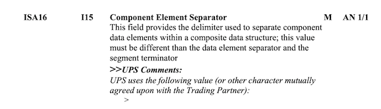
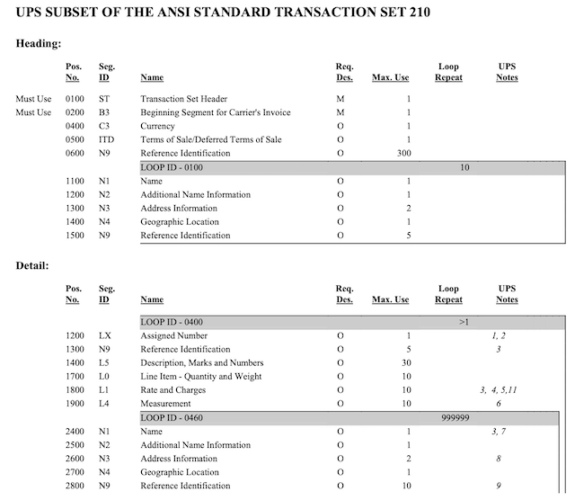

* [EDI Schema in Depth](#edi-schema-in-depth)
  * [General EDI Document Structure](#general-edi-document-structure)
  * [EDI Schema file\_declaration](#edi-schema-file_declaration)
  * [A Step\-by\-Step Real World EDI Schema Example](#a-step-by-step-real-world-edi-schema-example)
    * [Step: read the spec and prep](#step-read-the-spec-and-prep)
    * [Step: schema skeleton](#step-schema-skeleton)
    * [Step: understand and build the segment hierarchy](#step-understand-and-build-the-segment-hierarchy)
    * [Step: decide what the output JSON looks like\`](#step-decide-what-the-output-json-looks-like)
    * [Step: FINAL\_OUTPUT\.invoice\_number](#step-final_outputinvoice_number)
    * [Step: FINAL\_OUTPUT\.consolidated\_bill\_plan\_number](#step-final_outputconsolidated_bill_plan_number)
    * [Step: FINAL\_OUTPUT\.parties\.address](#step-final_outputpartiesaddress)
    * [Step: FINAL\_OUTPUT\.line\_items\.measurement\.quantity](#step-final_outputline_itemsmeasurementquantity)
    * [Step: FINAL\_OUTPUT\.line\_items\.consignees\.packages\.weight](#step-final_outputline_itemsconsigneespackagesweight)
  * [Segment Ambiguity](#segment-ambiguity)

# EDI Schema in Depth

[Electronic Data Interchange (EDI)](https://en.wikipedia.org/wiki/Electronic_data_interchange) is a data
format commonly used by business partners to exchange data electronically. There are lots of resources
covering the technical background of EDI and various standards (such as
[X12](https://en.wikipedia.org/wiki/ASC_X12), or [UN/EDIFACT](https://en.wikipedia.org/wiki/EDIFACT)),
this page won't get into them. It will focus on how to use omniparser (version `"omni.2.1"`) to write
EDI document schemas. Here we assume readers have reasonable familiarity around terms like EDI, segment,
delimiter, etc.

## General EDI Document Structure

EDI documents are usually not very human friendly. While they contain hierarchical data (very much like
XML documents), they are written serially, thus without schemas to describe hierarchical structures, it
is impossible to parse EDI documents correctly. The easiest way to understand EDI is to think an EDI
document as an XML document, containing many hierarchical data nodes, with opening tags (like `<ABC>`
in XML) but without closing tags (unlike `</ABC>` in XML). This critical missing-closing-tag difference
makes parsing EDI documents impossible without schema writers explicitly defining the hierarchy in
`file_declaration`.

Consider the following example
(excerpt from this [full sample input](../extensions/omniv21/samples/edi/1_canadapost_edi_214.input.txt)):
```
ISA*00*          *00*          *02*CPC            *ZZ*00602679321    *191103*1800*U*00401*000001644*0*P*>
GS*QM*CPC*00602679321*20191103*1800*000001644*X*004010
ST*214*000000001
B10*4343638097845589              *4343638097845589              *CPCC
L11*4343638097845589*97
L11*0000*86
```

The snippet contains 6 segments, all encoded serially. However, based on its business data provider's EDI
spec, the hierarchy of the segments is as follows
(again, simplified from this [full sample schema](../extensions/omniv21/samples/edi/1_canadapost_edi_214.schema.json)):
```
"file_declaration": {
    "element_delimiter": "*",
    "segment_delimiter": "\n",
    "segment_declarations": [
        {
            "name": "ISA",
            "child_segments": [
                {
                    "name": "GS",
                    "child_segments": [
                        {
                            "name": "scanInfo", "type": "segment_group", "min": 0, "max": -1, "is_target": true,
                            "child_segments": [
                                { "name": "ST" },
                                { "name": "B10", "elements": [ { "name": "shipmentIdentificationNumber", "index": 2 } ] },
                                { "name": "L11" },
                                { "name": "L11" },
...
...
```
- Segment `ISA` is the root of the EDI document, which contains a direct and sole child segment `GS`.
- Segment `GS` contains a virtual segment group `scanInfo` which contains a number of child segments
like `ST`, `B10`, `L11`, etc. While there is no physical representation of the virtual segment group
`scanInfo` in the input, it serves as a grouping mechanism for multiple child segments (or other child
segment groups).
- Once an EDI input's segment structure is defined, schema writer can further define how many times each
segment (or segment group) can appear in the input, and what data (called element) each segment contains
that we're interested - in omniparser EDI schema, we only need to define elements that we need to extract
and transform; those segments without `elements` definitions are just that they don't have data we need,
not that they don't actually contain any elements in the input. Please note the difference.

## EDI Schema `file_declaration`

A full EDI schema `file_declaration` is as follows:
```
"file_declaration": {
    "segment_delimiter": "<segment delimiter>",                     <== required
    "element_delimiter": "<element delimiter>",                     <== required
    "component_delimiter": "<component delimiter>",                 <== optional
    "release_character": "<release character>",                     <== optional
    "ignore_crlf": true/false,                                      <== optional
    "segment_declarations": [
        {
            "name": "<segment name>",                               <== required
            "type": "<segment type>",                               <== optional
            "is_target": true/false,                                <== optional
            "min": integer >= 0,                                    <== optional
            "max": integer >= -1,                                   <== optional
            "elements": [                                           <== optional
                {
                    "name": <element name>,                         <== required
                    "index": integer >= 1,                          <== required
                    "component_index": integer >= 1,                <== optional
                    "default": <default value>                      <== optional
                },
                // more elements
            ],
            "child_segments": [                                     <== optional
                // more segments or segment groups
            ]
        },
        // more segments or segment groups
}
```

- `segment_delimiter`: typically an ASCII character used for delimiting segments. While in most EDI
standards, `segment_delimiter` is of a single ASCII character, omniparser EDI schema actually allows
a UTF-8 string (thus allowing multiple characters), which comes in handy in some situations. For
example, some X12 EDI documents generated on Windows platform contain `"\r\n"` at the end of each
segment, even though its spec indicates `\n` as the delimiter.

- `element_delimiter`: delimiter to separate element data inside a segment. Again, while most EDI
standards call for a single ASCII character as `element_delimiter`, omniparser allows UTF-8 string.

- `component_delimiter`: delimiter to further separate an element data into several component pieces.
`component_delimiter` in omniparser allows UTF-8 string. This is optional, and if not specified, you
can treat each element as of a single component.

- `release_character`: an optional escape character for delimiters. Imagine a piece of element data
contains a `*` which happens to be `element_delimiter`. Without escaping, parser would treat that `*`
as a real delimiter. Any character preceded by `release_character` will be treated literally.
`release_character` will be removed from the data in the transform output.

- `ignore_crlf`: if true, all CR (carriage return `"\r"`) or LF (line feed `"\n"`) characters in the
input will be ignored. While strict EDI spec requires explicit segment delimiter declaration and allows
no additional character between two segments (other than segment delimiter), in reality, many data
providers insert a LF (sometimes CR and LF on Windows platform) in between segments, despite segment
delimiter is some other character. For example,
[UPS EDI 210](../extensions/omniv21/samples/edi/2_ups_edi_210.schema.json). In such case, schema writers
can specify `"ignore_crlf": true` and omniparser will ignore all these CR and LF characters. Note some
EDI data providers do use LF (`"\n"`) (or CRLF `"\r\n"`) as segment delimiter, in such cases, specify LF
(or CRLF) in `segment_delimiter` and do not use `ignore_crlf`. For example,
[CanadaPost EDI 214](../extensions/omniv21/samples/edi/1_canadapost_edi_214.schema.json).

- `segment_declarations`: specifies a list of top-level segments (or segment groups) in the EDI
document, each of which is defined as follows:

- segment / segment group:
    - `type`: specifies if it is a `segment` or a `segment_group`.
    - `name`: name of the segment/segment_group; if `type` is `segment`, then the name must
    match the actual segment name (such as `ISA`, `GT`, `L11`, etc) in EDI document.
    - `is_target`: specifies if it is a target segment/segment_group that will be returned to the
    caller. In an EDI schema, there must be one and only segment/segment_group marked with
    `"is_target": true`.
    - `min`: specifies the minimally required occurrences of the segment/segment_group. If not
    specified, a default value of 1 is used.
    - `max`: specifies the maximally required occurrences of the segment/segment_group. If not
    specified, a default value of 1 is used. If -1 is specified, then there is no upper limit of
    this segment/segment_group occurrences.
    - `elements.name`: a schema writer assigned name to an element of the segment that can be later
    referenced in XPath query for data extraction. `elements.name` can only be used in segments.
    - `elements.index`: the element index. Recall each segment has a segment name followed by a
    number of elements delimited by `element_delimiter`. `elements.index` is 1-based for indexing
    and referencing the element pieces schema writer is interested in. If the index is out of bound
    for a given occurrence of a segment, then error will be raised unless `elements.default`
    is specified.
    - `elements.component_index`: the component index inside an element. Recall per EDI spec, each
    element can optionally have multiple components, each of which is delimited by
    `component_delimiter`. Optional and default to 1, if not specified. If `elements.component_index`
    is out of bound, then error will be raised unless `elements.default` is specified.
    - `elements.default`: specifies what default string value to use if either `elements.index` or
    `elements.component_index` is out of bound.
    - `elements.child_segments`: define child segment/segment_groups, recursively.

## A Step-by-Step Real World EDI Schema Example

An EDI schema has 3 parts: `parser_settings`, `file_declaration` and `transform_declarations`.
`parser_settings` is trivial and already covered in [Getting Started](./gettingstarted.md#parser_settings)
doc. `transform_declarations` in EDI schema is no different from schemas for any other file formats,
and is covered in [All About Transforms](./transforms.md). Based on experience, we find writing
`file_declaration` proves to be the most difficult part of authoring an EDI omniparser schema.

While there are semi-official specs for different EDI documents and templates (such as
[X12 document list](https://en.wikipedia.org/wiki/X12_Document_List)), each business/trading partners
usually have their own specs of particular EDI documents with different segment occurrence requirements,
element placements, looping constraints, etc. For example, UPS has its own EDI 240/214 spec which is
completely different from, say, Canada Post's EDI 214 spec. Understanding your business EDI spec is the
first, and most crucial step before writing an EDI schema.

In this section, we'll go in-depth covering how to write a (fairly complex) real world EDI schema step
by step. The target schema is UPS EDI 210 for its shipping billing document. The download page is
[here](https://www.ups.com/us/en/help-center/billing-payment/edi-manual.page) and the direct spec PDF
link is [here](https://www.ups.com/assets/resources/media/billingSEF.pdf).

Like we mentioned in the [Getting Started](./gettingstarted.md#cli-command-line-interface) doc, it's
highly recommended writing a schema incrementally with omniparser CLI.

### Step: read the spec and prep

Yes, the [spec](https://www.ups.com/assets/resources/media/billingSEF.pdf) is a bit intimidating, but
it is essential to go over it. We'll use the example in section 7-1 (p103) - it has been extracted out
and saved [here](../extensions/omniv21/samples/edi/2_ups_edi_210.input.txt).

### Step: schema skeleton

The spec doesn't formally spell out segment delimiter and element delimiter but it did mention component
delimiter (p28):


Inspecting the [input](../extensions/omniv21/samples/edi/2_ups_edi_210.input.txt) we can see from the
first segment line
```
ISA*00*          *00*          *02*UPSN           *ZZ*PHH            *080626*2115*U*00400*000002838*0*T*>|
```
that segment delimiter is `|` and element delimiter is `*`. Also notice the use of `\n` throughout the
input.

So the skeleton of the schema (assume we name the schema file `test.schema.json`) would look like this:

```
{
    "parser_settings": {
        "version": "omni.2.1",
        "file_format_type": "edi"
    },
    "file_declaration": {
        "segment_delimiter": "|",
        "element_delimiter": "*",
        "component_delimiter": ">",
        "ignore_crlf": true,
        "segment_declarations": [
        ]
    },
    "transform_declarations": {
        "FINAL_OUTPUT": { "object": {
        }}
    }
}
```

Run the cli (may need to adjust the path to the [cli.sh](../cli.sh)):
```
$ cli.sh transform -i 2_ups_edi_210.input.txt -s test.schema.json

Error: schema 'test.schema.json': missing segment/segment_group with 'is_target' = true
```
Good progress and expected error. Now let's work on `segment_declarations`.

### Step: understand and build the segment hierarchy

Every business/trading partners' EDI specs are drafted differently, some are easier to read, and some
are more formal and harder to parse. UPS EDI specs typically have a section about the overall segment
and loop structures: p31 - p32



The hierarchy chart only covers the main body of UPS specific EDI 210 spec, leaving out the standard
`ISA`, `GS`, `GE`, and `IEA` segments out. Based on the chart, we can derive a rough segment
hierarchy of the UPS 210 EDI schema:

```
ISA
├─ GS
│  ├─ <loop for multiple invoices>
│     ├─ ST
│     ├─ B3
│     ├─ ...
│     ├─ N9
│     ├─ <loop 0100: shippers/consignees info>
│     │  ├─ N1
│     │  ├─ N2
│     │  ├─ ...
│     │  ├─ N9
│     ├─ <loop 0400: line items on the invoice>
│     │  ├─ LX
│     │  ├─ N9
│     │  ├─ ...
│     │  ├─ L4
│     │  ├─ <loop 0460: shippers/consignees info for the line item>
│     │     ├─ N1
│     │     ├─ ...
│     │     ├─ N9
│     │     ├─ <loop 0463: carton/package info for the particular shipper/consignee>
│     │        ├─ CD3
│     │        ├─ ...
│     │        ├─ N9
│     ├─ L3
│     ├─ SE
├─ GE
IEA
```

We can sketch out the `segment_declarations` with the hierarchy outlined above:
(only `segment_declarations` part, rest of the schema is omitted for brevity)
```
"segment_declarations": [
    {
        "name": "ISA",
        "child_segments": [
            {
                "name": "GS",
                "child_segments": [
                    {
                        "name": "invoiceInfo", "type": "segment_group",
                        "child_segments": [
                            { "name": "ST" },
                            { "name": "B3" },
                            { "name": "C3" },
                            { "name": "ITD" },
                            { "name": "N9" },
                            {
                                "name": "partyInfo", "type": "segment_group",
                                "child_segments": [
                                    { "name": "N1" },
                                    { "name": "N2" },
                                    { "name": "N3" },
                                    { "name": "N4" },
                                    { "name": "N9" }
                                ]
                            },
                            {
                                "name": "lineItemInfo", "type": "segment_group",
                                "child_segments": [
                                    { "name": "LX" },
                                    { "name": "N9" },
                                    { "name": "L5" },
                                    { "name": "L0" },
                                    { "name": "L1" },
                                    { "name": "L4" },
                                    {
                                        "name": "consigneeInfo", "type": "segment_group",
                                        "child_segments": [
                                            { "name": "N1" },
                                            { "name": "N2" },
                                            { "name": "N3" },
                                            { "name": "N4" },
                                            { "name": "N9" },
                                            {
                                                "name": "cartonInfo", "type": "segment_group",
                                                "child_segments": [
                                                    { "name": "CD3" },
                                                    { "name": "N9" }
                                                ]
                                            }
                                        ]
                                    }
                                ]
                            },
                            { "name": "L3" },
                            { "name": "SE" }
                        ]
                    }
                ]
            },
            { "name": "GE" }
        ]
    },
    { "name": "IEA" }
]
```

Run the cli:
```
$ cli.sh transform -i 2_ups_edi_210.input.txt -s test.schema.json

Error: schema 'test.schema.json': missing segment/segment_group with 'is_target' = true
```

Ah, right, we haven't specified which segment/segment_group is the target entity for extraction and
transform. In this example, UPS EDI 210 doc contains multiple invoices, so we want to designate
the segment group `invoiceInfo` as the target: let's add `is_target` to it:
```
"name": "invoiceInfo", "type": "segment_group", "is_target": true,
```

Rerun cli:
```
$ cli.sh transform -i 2_ups_edi_210.input.txt -s test.schema.json

Error: input '2_ups_edi_210.input.txt' at segment no.11 (char[334,334]): segment 'ISA/GS/invoiceInfo/partyInfo/N4' needs min occur 1, but only got 0
```
Given the sample input has one line one segment format, the error message's segment number `no.11`
is basically the line number of the input file. What this error message says: in your schema
`segment_declarations`, the segment `N4` (full path to the segment is `ISA/GS/invoiceInfo/partyInfo/N4`)
is declared to have a minimal occurrence of 1, and is expected at line 11, but is not found there.
Let's find the gap.

Look back to the hierarchy chart in the spec, find the segment `N4`, we can see:

```
Pos.No.   Seg.ID    ...     Req.Des.    Max.Use
...
1400      N4                O           1
...
```

`Req.Des.` has these most frequently used values: `M`, `O` (Oh, not zero), and `X`, which means
`Mandatory`, `Optional`, and `Conditional`, respectively. For all practical purposes of omniparser
EDI schema writing, you can treat `X` the same as `O`.

So this particular segment `N4` is actually optional, that's why when we write `{ "name": "N4" },` in
our test schema, the default values for `min` and `max` become 1, thus the failure.

Now let's modify the segment decl to:
```
{ "name": "N4", "min": 0 },
```
and rerun cli:
```
$ cli.sh transform -i 2_ups_edi_210.input.txt -s test.schema.json

Error: input '2_ups_edi_210.input.txt' at segment no.11 (char[334,334]): segment 'ISA/GS/invoiceInfo/partyInfo/N9' needs min occur 1, but only got 0
```
Ah, similar problem we have for segment `N9`. Instead, doing one by one, let's scrub through all the
segments in our test schema and fix their min/max according to the spec. We have:
```
"segment_declarations": [
    {
        "name": "ISA",
        "child_segments": [
            {
                "name": "GS",
                "child_segments": [
                    {
                        "name": "invoiceInfo", "type": "segment_group", "min": 0, "max": -1, "is_target": true,
                        "child_segments": [
                            { "name": "ST" },
                            { "name": "B3" },
                            { "name": "C3" },
                            { "name": "ITD", "min": 0 },
                            { "name": "N9", "min": 0, "max": 300 },
                            {
                                "name": "partyInfo", "type": "segment_group", "min": 0, "max": 10,
                                "child_segments": [
                                    { "name": "N1", "min": 0 },
                                    { "name": "N2", "min": 0 },
                                    { "name": "N3", "min": 0, "max": 2 },
                                    { "name": "N4", "min": 0 },
                                    { "name": "N9", "min": 0, "max": 5 }
                                ]
                            },
                            {
                                "name": "lineItemInfo", "type": "segment_group", "min": 0, "max": -1,
                                "child_segments": [
                                    { "name": "LX", "min": 0 },
                                    { "name": "N9", "min": 0, "max": 5 },
                                    { "name": "L5", "min": 0, "max": 30 },
                                    { "name": "L0", "min": 0, "max": 10 },
                                    { "name": "L1", "min": 0, "max": -1 },
                                    { "name": "L4", "min": 0, "max": 10 },
                                    {
                                        "name": "consigneeInfo", "type": "segment_group", "min": 0, "max": -1,
                                        "child_segments": [
                                            { "name": "N1", "min": 0 },
                                            { "name": "N2", "min": 0 },
                                            { "name": "N3", "min": 0, "max": 2 },
                                            { "name": "N4", "min": 0 },
                                            { "name": "N9", "min": 0, "max": 7 },
                                            {
                                                "name": "cartonInfo", "type": "segment_group", "min": 0, "max": -1,
                                                "child_segments": [
                                                    { "name": "CD3", "min": 0 },
                                                    { "name": "N9", "min": 0, "max": 20 }
                                                ]
                                            }
                                        ]
                                    }
                                ]
                            },
                            { "name": "L3", "min": 0 },
                            { "name": "SE" }
                        ]
                    }
                ]
            },
            { "name": "GE" }
        ]
    },
    { "name": "IEA" }
]
```

and rerun cli:
```
$ cli.sh transform -i 2_ups_edi_210.input.txt -s test.schema.json
[
	null,
	null,
	null,
	null,
	null
]
```
Fantastic! What you see here is that omniparser successfully parsed through the entire sample input
file according to the test schema and encountered no error whatsoever. It extracted out 5 invoices
from the input, correctly. They're all `null` for now, because we haven't written anything in
`transform_declarations` yet.

### Step: decide what the output JSON looks like`

With the hierarchy and segment min/max figured out, now we can incrementally build the entire transform.
But first let's figure out what we want out from the transform.

Imagine, we want to extract each invoice out and transform it into a JSON object. We want the JSON
object has roughly the following:
```
{
    // invoice related fields, such as
    "invoice_number": "0000001808WW308",
    ...
    // shippers and consignee array
    "parties": [
        ...
    ],
    // array of line items of the invoice
    "line_items": [
        // line item fields, such as
        "tracking_number": ...
        // fees and charges array
        "fees_and_charges": [
            ...
        ],
        // consignees of the line item
        "consignees": [
            // general consignee info
            ...
            // pacakges that will be delivered to the consignee.
            "packages": [
                ...
            ]
        ]
    ]
}
```

### Step: `FINAL_OUTPUT.invoice_number`

Upon reading the spec, we find segment `B3` contains the invoice number information (p34), or more
precisely, the second element of segment `B3`. Let's add the element into `B3` declaration:
```
{ "name": "B3", "elements": [
    { "name": "invoiceNumber", "index": 2 }
]},
```
And we can add the transform reference into the `FINAL_OUTPUT` directly:
```
"FINAL_OUTPUT": { "object": {
    "invoice_number": { "xpath": "B3/invoiceNumber" }
}}
```
Run cli we have:
```
$ cli.sh transform -i 2_ups_edi_210.input.txt -s test.schema.json 
[
	{
		"invoice_number": "0000001808WW308"
	},
	{
		"invoice_number": "0000001502WW308"
	},
	{
		"invoice_number": "0000004045WW308"
	},
	{
		"invoice_number": "0000002063WW308"
	},
	{
		"invoice_number": "0000004469WW318"
	}
]
```

Following a similar process, you can incrementally add more and more fields into `FINAL_OUTPUT` to
complete the schema. You can see the
[final completed schema here](../extensions/omniv21/samples/edi/2_ups_edi_210.schema.json).

The rest of the guide will only cover a few interesting/difficult ones.

### Step: `FINAL_OUTPUT.consolidated_bill_plan_number`

Observe the field `FINAL_OUTPUT.consolidated_bill_plan_number` in the
[final schema](../extensions/omniv21/samples/edi/2_ups_edi_210.schema.json):
```
"consolidated_bill_plan_number": { "xpath": "N9[refIdQualifier='18']/refId" },
```

This UPS EDI 210 spec extensively uses `N9` segments for carrying various and multiple IDs: each
instance of `N9` generally has the first element as the ID qualifier, indicating what the ID value
is about, and then has the second element as the actual ID value. Sometimes, we can have multiple
`N9`s to carry several types of IDs. So when we want to extract a certain ID, we need to use this
conditional XPath query as shown above. In this particular case, the relevant `N9` spec is on p38.

### Step: `FINAL_OUTPUT.parties.address`

In the spec under loop 0100, we have `N3` and `N4` used for shipper/consignee address information
(covered in p41-p42). Notice we also use `N3` and `N4` for consignee address in loop 0460.
Therefore, it makes sense to create a transform template to extract/transform an address object
from `N3`/`N4`. That's exactly what we did here
```
"FINAL_OUTPUT": { "object": {
    ...
    "parties": { "array": [
        { "xpath": "partyInfo", "object": {
            ...
            "address": { "template": "n3_n4_address_template" }
        }}
    ]},
    "line_items": { "array": [
        { "xpath": "lineItemInfo", "object": {
            "consignees": { "array": [
                { "xpath": "consigneeInfo[N1/entityIdentifierCode='CN']", "object": {
                    ...
                    "address": { "template": "n3_n4_address_template" },
                    ...
                }}
            ]}
        }}
    ]}
    ...
}},
"n3_n4_address_template": { "object": {
    "line1": { "xpath": "N3[position()=1]/address1" },
    "line2": { "xpath": "N3[position()=1]/address2" },
    "line3": { "xpath": "N3[position()=2]/address1" },
    "line4": { "xpath": "N3[position()=2]/address2" },
    "city": { "xpath": "N4/city" },
    "state_province": { "xpath": "N4/state_province" },
    "postal_code": { "xpath": "N4/postal_code" },
    "country": { "xpath": "N4/country" }
}}
```

When you through the [output](../extensions/omniv21/samples/edi/.snapshots/Test2_UPS_EDI_210), you
might notice most the time, there is only `line1` in the output. This is because for most places in
the input, there is only one instance of `N3` and for that instance of `N3`, `address2` element is
optional as well. Omniparser knows when to omit a field, when its field is empty or its XPath query
doesn't yield any result.

### Step: `FINAL_OUTPUT.line_items.measurement.quantity`

While the quantity transform itself looks bland and uninteresting:
`"quantity": { "xpath": "quantity", "type": "int" }`, its segment element declaration has a subtle
trick employed:
```
{ "name": "quantity", "index": 5, "default": "1" }
```

Not all `L4` segments contains quantity element, therefore if we use the normal `"default": ""`, the
transform type cast to `int` would fail.

### Step: `FINAL_OUTPUT.line_items.consignees.packages.weight`

A similar situation to `FINAL_OUTPUT.line_items.measurement.quantity` but we employed a different
technique here.

Unlike `quantity`, we can default to 1, it's inappropriate to have a default numeric value to the
weight field: the best practice is to either use null JSON value, or simply leave out the field all
together from the output.

We, therefore, have the `weight` element declaration be:
```
{ "name": "weight", "index": 2, "default": "" },
```
(Note we use the normal `"default": ""` approach here)
And have the `weight` field transform be:
```
"weight": { "custom_func": {
    "name": "javascript",
    "args": [
        { "const":  "w ? parseFloat(w) : ''" },
        { "const": "w" }, { "xpath": "CD3/weight" }
    ]
}},
```
This way, if `CD3/weight` is not specified in the input, the script will return empty string causing
omniparser to omit the `weight` field from the output; the value is present in the input, then we will
do float parsing and return the result as type-casted float value.

## Segment Ambiguity
The most difficult part of authoring an EDI schema is to declare the segment/segment_group structure
and their occurrence constraints (`min`/`max`). Part of the difficulties come from segment ambiguity.
Technically there is nothing preventing from business EDI spec author from declaring similarly named
segments containing different business data and yet all being optional. Imagine there is a segment
called `ABC`, and in an EDI spec, we have:
```
Pos.No.   Seg.ID    Req.Des.    Max.Use     Desc
...
0100      ABC       O           1           contains spouse 1 name
0200      ABC       O           1           contains spouse 2 name
...
```
In situations like this, the ambiguity is unsolvable, unless the two `ABC` segments have different
element structures, which, given optional natures of elements, still leads to ambiguity almost all
the time. Omniparser takes a simple/simplistic route with a greedy algorithm, by pattern-matching
the input segments against the schema as much as possible, without any backtracking. See more details
in the function comment of [`matchSegName()`](../extensions/omniv21/fileformat/edi/seg.go) and [a
closed github issue](https://github.com/jf-tech/omniparser/issues/114) with more in-depth discussion.
