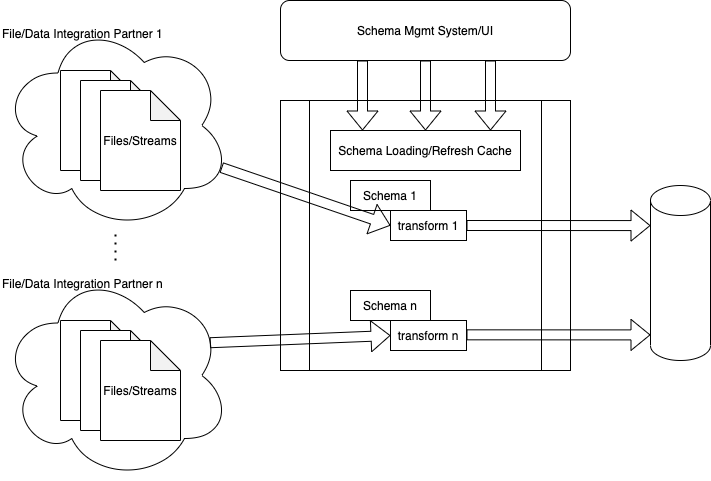

* [Programmability of Omniparser](#programmability-of-omniparser)
  * [Out\-of\-Box Basic Use Case](#out-of-box-basic-use-case)
  * [Add A New custom\_func](#add-a-new-custom_func)
  * [Add A New custom\_parse](#add-a-new-custom_parse)
  * [Add A New File Format](#add-a-new-file-format)
  * [Add A New Schema Handler](#add-a-new-schema-handler)
  * [Put All Together](#put-all-together)
  * [In Non\-Golang Environment](#in-non-golang-environment)
* [Programmability of Some Components without Omniparser](#programmability-of-some-components-without-omniparser)
  * [Functions](#functions)
  * [IDR](#idr)
  * [CSV Reader](#csv-reader)
  * [Fixed\-Length Reader](#fixed-length-reader)
  * [Full EDI Reader](#full-edi-reader)
  * [Non\-Validating EDI Segment Reader](#non-validating-edi-segment-reader)
  * [JSON Reader](#json-reader)
  * [XML Reader](#xml-reader)

# Programmability of Omniparser

There are many ways to use omniparser in your code/service/app programmatically.

## Out-of-Box Basic Use Case

This is covered in [Getting Started](./gettingstarted.md#using-omniparser-programmatically), copy it
here for completeness.
```
schema, err := omniparser.NewSchema("your schema name", strings.NewReader("your schema content"))
if err != nil { ... }
transform, err := schema.NewTransform("your input name", strings.NewReader("your input content"), &transformctx.Ctx{})
if err != nil { ... }
for {
    output, err := transform.Read()
    if err == io.EOF {
        break
    }
    if err != nil { ... }
    // output contains a []byte of the ingested and transformed record.
}
```
Note this out-of-box omniparser setup contains only the `omni.2.1` schema handler, meaning only schemas
whose `parser_settings.version` is `omni.2.1` are supported. `omni.2.1.` schema handler's supported file
formats include: delimited (CSV, TSV, etc), EDI, XML, JSON, fixed-length. `omni.2.1.` schema handler's
supported built-in `custom_func`s are listed [here](./customfuncs.md).

## Add A New `custom_func`

If the built-in `custom_func`s are enough, you can add your own custom functions by
[doing this](../extensions/omniv21/samples/customfileformats/jsonlog/sample_test.go) (note the linked
sample does more than just adding a new `custom_func`):
```
schema, err := omniparser.NewSchema(
    "your schema name",
    strings.NewReader("your schema content"),
    omniparser.Extension{
        CreateSchemaHandler: omniv21.CreateSchemaHandler,
        CustomFuncs: customfuncs.Merge(
            customfuncs.CommonCustomFuncs,                // global custom_funcs
            v21.OmniV21CustomFuncs,                       // omni.2.1 custom_funcs
            customfuncs.CustomFuncs{
                "normalize_severity": normalizeSeverity,  // <====== your own custom_funcs
            })})
if err != nil { ... }
transform, err := schema.NewTransform("your input name", strings.NewReader("your input content"), &transformctx.Ctx{})
if err != nil { ... }
for {
    output, err := transform.Read()
    if err == io.EOF {
        break
    }
    if err != nil { ... }
    // output contains a []byte of the ingested and transformed record.
}
```

Each `custom_func` must be a Golang function with the first param being `*transformctx.Ctx`. The rest
params can be of any type, as long as they will match the types of data that are fed into the function
in `transform_declarations`.

## Add A New `custom_parse`

There are several ways to customize transform logic, one of which is using the all mighty `custom_func`
`javascript` (or its silibing `javascript_with_context`), see details
[here](./use_of_custom_funcs.md#javascript-and-javascript_with_context).

However currently we don't support multi-line javascript (yet), which makes writing complex transform
logic in a single line javascript difficult to read and debug. Also there are situations where schema
writers want the following:
- native Golang code transform logic
- logging/stats
- better/thorough test coverage
- more complexed operations like RPCs calls, encryption, etc, which isn't really suited/possible for
javascript to handle.

`custom_parse` provides an in-code transform plugin mechanism. In addition to a number of built-in
transforms, such as field, `const`, `external`, `object`, `template`, `array`, and `custom_func`,
`custom_parse` allows schema writer to be able to provide a Golang function that takes in the
`*idr.Node` at the current IDR cursor (see more about IDR cursoring
[here](./xpath.md#data-context-and-anchoring)), does whatever processing and transforms as it sees
fit, and returns whatever the desired result to be embedded in place of the `custom_parse`.

[This sample](../extensions/omniv21/samples/customparse/sample_test.go) gives a very detailed demo
of how `custom_parse` works.

## Add A New File Format

While built-in `omni.2.1` schema handler already supports most popular file formats in a typical
ETL pipeline, new file format(s) can be added into the schema handler, so it can ingest new formats
while using the same extensible/capable transform (`transform_declarations`) logic.

On a high level, a [`FileFormat`](../extensions/omniv21/fileformat/fileformat.go) is a component
that knows how to ingest a data record, in streaming fashion, from a certain file format, and
convert it into an `idr.Node` tree, for later processing and transform.

Typically, a new [`FileFormat`](../extensions/omniv21/fileformat/fileformat.go) may require some
additional information in a schema (usually in a `file_declaration` section), thus `omni.2.1` schema
handler will give a new custom [`FileFormat`](../extensions/omniv21/fileformat/fileformat.go) a
chance to validate a schema. Then the schema handler will ask
the new [`FileFormat`](../extensions/omniv21/fileformat/fileformat.go) to create a format specific
reader, whose job is to consume input stream, and convert each record into the IDR format.

See [this example](../extensions/omniv21/samples/customfileformats) for how to add a new
[`FileFormat`](../extensions/omniv21/fileformat/fileformat.go).

## Add A New Schema Handler

To complete omniparser's full extensibility picture, we allow adding complete new schema handlers,
whether they're for major schema version upgrades that break backward-compatibility, or for brand-new
parsing/transform paradigms. In fact, we utilize this customizability capability ourselves for
integrating those legacy omniparser schema supports (schema versions that are older than `omni.2.1`
and are not compatible with `omni.2.1`): take a glimpse at: https://github.com/jf-tech/omniparserlegacy.

## Put All Together

The most canonical use case of omniparser would be a (micro)service that is part of a larger ETL
pipeline that gets different input files/streams from different external integration influx points,
performs schema driven (thus codeless) parsing and transform to process and standardize the inputs
into internal formats for later stage loading (L) part of ETL.

Because omniparser's parsing and transform is schema driven and involves little/no coding, it enables
faster and at-scale ETL integration possibly done by non-coding engineers or support staffs:



First in your service, there needs to be a schema cache component that loads and refreshes all the
schemas from a schema repository (could be a REST API, or a database, or some storage). These schemas
are parsed, validated (by [`omniparser.NewSchema`](../schema.go) calls) and cached.

As different integration partners' input streams are coming in, the service will, based on some
criteria, such as partner IDs, select which schema to use for a particular input. Once schema
selection is completed, the service calls [`schema.NewTransform`](../schema.go) to create an
instance of a transform operation for this particular input, performs the parsing and transform, and
sends the standardized output into a later stage in the ETL pipeline.

## In Non-Golang Environment

Omniparser is currently only implemented in Golang (we do want to port it to other languages, at least
Java, in the near future), the only way to utilize it, if your service or environment is not in Golang,
is to sidecar it, by either making it a standard alone service or shell-exec omniparser, both of which
involves omniparser's CLI.

Recall in [Getting Started](./gettingstarted.md#cli-command-line-interface) we demonstrated omniparser
CLI's `transform` command. You can shell-exec it from your service. Keep in mind the following if you
want to go down this path:
- you will have to pre-compile omniparser CLI binary (which needs to platform/OS specific) and ship with
your service, and
- you will need to copy down the input file locally in your service before invoking the CLI, and then
intercept `stdout`/`stderr` from the CLI and its exit code in order to get the results.

Omniparser CLI has another command `server`, which simply launches the CLI into a http listening service
that exposes a REST API:
- `POST`
- request `Content-Type`: `application/json`
- request JSON:
    ```
    {
        "schema": "... the schema content, required ...",
        "input": "... the input to be parsed and transformed, required ...",
        "properties": { ... JSON string map used for `external` transforms, optional ...}
    }
    ```
Keep in mind the following if you want to go down this path:
- you will need to host this CLI-turned omniparser service somewhere accessible to your service,
- you lose the benefit of omniparser stream processing, which enables parsing infinitely large input,
because now you need to send the input as a single string in the `input` field of the HTTP POST request.

# Programmability of Some Components without Omniparser

There are many components inside omniparser can be useful in your code, even if you don't want to
use omniparser as a whole for parsing and transforming input file/data. Here is a selected list of
these components:

## Functions

- [`DateTimeToRFC3339()`, `DateTimeLayoutToRFC3339()`, `DateTimeToEpoch()`, `EpochToDateTimeRFC3339()`](../customfuncs/datetime.go)

    Parsing and formatting date/time stamps isn't trivial at all, especially when time zones are
    involved. These functions can be used independent of omniparser and are very useful when your
    Golang code deals with date/time a lot.

- [`JavaScript()`](../extensions/omniv21/customfuncs/javascript.go):

  Omniparser uses github.com/dop251/goja as the native Golang javascript engine. Yes you can directly
  use `goja`, but you'll have to deal with performance related vm caching, and error handling. Instead
  you can directly use `JavaScript` function.

## IDR

We have an in-depth [doc](./idr.md) talking about IDR, which proves to be really useful in many document
parsing situations, even outside of omniparser realm. This `idr` package contains the IDR node/tree
definitions, creation, caching, recycling and releasing mechanisms, serialization helpers, XPath
assisted navigation and querying, and two powerful stream readers for JSON and XML inputs.

Particularly, the [JSON](../idr/jsonreader.go)/[XML](../idr/xmlreader.go) readers are two powerful
parsers, capable of ingesting JSON/XML data in streaming fashion assisted by XPath style target
filtering, thus enabling processing arbitrarily large inputs.

## CSV Reader

Use [`NewReader()`](../extensions/omniv21/fileformat/csv/reader.go) to create a CSV reader that does
- header column validation
- header/data row jumping
- XPath based data row filtering
- Mis-escaped quote replacement
- Context-aware error message

For more reader specific settings/configurations, check
[CSV in Depth](./csv_in_depth.md#csv-file_declaration) page.

## Fixed-Length Reader

Use [`NewReader()`](../extensions/omniv21/fileformat/fixedlength/reader.go) to create a fixed-length
reader that does
- row based or header/footer based envelope parsing
- XPath based data row filtering
- Context-aware error message

For more reader specific settings/configurations, check
[Fixed-Length in Depth](./fixedlength_in_depth.md) page.

## Full EDI Reader

Use [`NewReader()`](../extensions/omniv21/fileformat/edi/reader.go) to create an EDI reader that does
- segment min/max validation
- XPath based data row filtering
- Context-aware error message

For more reader specific settings/configurations, check
[EDI in Depth](./edi_in_depth.md) page.

## Non-Validating EDI Segment Reader

Use [`NewNonValidatingReader()`](../extensions/omniv21/fileformat/edi/reader2.go) to create a
non-validating EDI segment reader. Sometimes user might not want the full EDI reader that does
many packing/unpacking and structural/hierarchical validations, they simply need an EDI segment
reader that reads out all the raw segments and their elements/components.

Usage example:
```
r := edi.NewNonValidatingReader(
    strings.NewReader("....."),
    &edi.FileDecl{
        SegDelim: ...,
        ElemDelim: ...,
        ...,
        // No need to set SegDecls. Just all the needed top level edi.FileDecl settings.
    })
for {
    seg, err := r.Read()
    if err == io.EOF {
        break
    }
    if err != nil { ... }
    // seg contains the raw segment data, and is of edi.RawSeg type.
}
```

## JSON Reader
See [IDR](#idr) notes about the JSON/XML readers above.

## XML Reader
See [IDR](#idr) notes about the JSON/XML readers above.